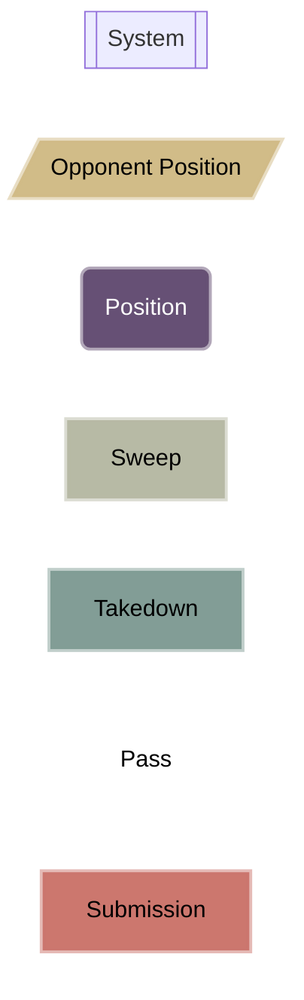

# bjj-flows
A repo serving as my BJJ lesson log book and flowcharts around crafting my game.

## Legend

```mermaid
  flowchart LR;
      A[[System]];
      B[/Opponent Position/]:::_oppo;
      C(Position):::_position;
      D[Sweep]:::_sweep;
      E[Takedown]:::_takedown;
      F[Pass]:::_pass;
      G[Submission]:::_submission;
      
      classDef _oppo fill:#D1BC88,color:#000,stroke:#D1BC8880,stroke-width:4px
      classDef _sweep fill:#B7BAA5,color:#000,stroke:#B7BAA580,stroke-width:4px
      classDef _takedown fill:#829D96,color:#000,stroke:#829D9680,stroke-width:4px
      classDef _submission fill:#CC776E,color:#000,stroke:#CC776E80,stroke-width:4px
      classDef _position fill:#665075,color:#FFF,stroke:#66507580,stroke-width:4px
      classDef _system fill:#FFFFFF,color:#000,stroke:#FFFFFF80,stroke-width:4px
      classDef _pass fill:#FFFFFF,color:#000,stroke:#FFFFFF80,stroke-width:4px
```

More syntax notes: https://mermaid.js.org/syntax/flowchart.html
