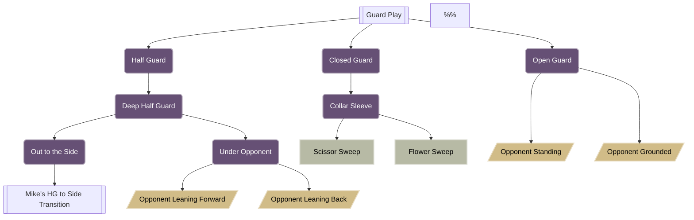

# Bottom Game

```mermaid
  flowchart TD;
      A[[Guard Play]]--> CG & HG & OG;

      %% BEGIN Half Guard
      %%

      HG(Half Guard):::_position--> DHG;
      DHG(Deep Half Guard):::_position--> DHGS & DHGU;
      DHGS(Out to the Side):::_position--> OTS[[Mike's HG to Side Transition]];
      DHGU(Under Opponent):::_position--> U1 & U2;
      U1[/Opponent Leaning Forward/]:::_oppo;
      U2[/Opponent Leaning Back/]:::_oppo;

      %%
      %% END Half Guard

      %% BEGIN Closed Guard
      %%

      CG(Closed Guard):::_position--> D1;
      D1(Collar Sleeve):::_position--> E1 & E2;
      E1[Scissor Sweep]:::_sweep;
      E2[Flower Sweep]:::_sweep;


      %%
      %% END Closed Guard

      %% BEGIN Open Guard
      %%

      OG(Open Guard):::_position---> C1 & C2;
      C1[/Opponent Standing/]:::_oppo;
      C2[/Opponent Grounded/]:::_oppo;

      %%
      %% END Open Guard

      %%D[Sweep]:::_sweep;
      %%E[Takedown]:::_takedown;
      %%F[Pass]:::_pass;
      %%G[Submission]:::_submission;

      classDef _oppo fill:#D1BC88,color:#000,stroke:#D1BC8880,stroke-width:4px
      classDef _sweep fill:#B7BAA5,color:#000,stroke:#B7BAA580,stroke-width:4px
      classDef _takedown fill:#829D96,color:#000,stroke:#829D9680,stroke-width:4px
      classDef _submission fill:#CC776E,color:#000,stroke:#CC776E80,stroke-width:4px
      classDef _position fill:#665075,color:#FFF,stroke:#66507580,stroke-width:4px
      classDef _system fill:#FFFFFF,color:#000,stroke:#FFFFFF80,stroke-width:4px
      classDef _pass fill:#FFFFFF,color:#000,stroke:#00000080,stroke-width:4px
```
